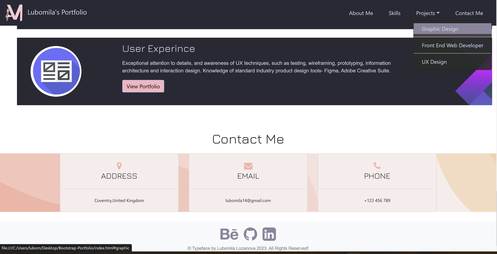

# Lubomila Lozanova's Portfolio

## Table of Contents 

- [Description](#description)
- [Usage](#usage)
- [Features](#features)
- [Installation](#installation)
- [Credits](#credits)
- [License](#license)

## Description

"Lubomila Lozanova's Portfolio" is a project, which was created with a framework for building responsive, mobile-first sites, with jsDelivr and a template starter page- Bootstrap. With this challenge, I would like to show my projects, information about me, my skills, how I can be contacted and external links leading to my resume and portfolio.
 This weekly activity targets particular skills, which I developed by this point - accessibility, flexbox, media queries,CSS variables and using Bootstrap.

 ## Usage
 The list shows what changes were made to improve the website:

- When the page is loaded the page presents my name, my logo, and links to sections about me, my projects,skills and contact information.
- Clicking on one of the sections in the navigation bar, the UI scrolls to the corresponding section. Dropdown menu was included as well.

- When Media Queries are applied, the navigation bar is changing to Mobile Navigation Bar,also called "Hamburger Menu".
.png)
- To apply the color palette easily, I used CSS Variables.
- "About Me" section includes information about me, my picture, an external link leading to my resume and a background picture.
- "Skills" section contains three cards with skills that I would like to achieve by the end of this course. To make them, I used a Bootstrap card layout.
- "Project" section includes three cards with information. External links were added and they are leading to my Portfolio websites- Behance and GitHub.
- The HTML links are displayed in a different color depending on whether it has been active or the mouse is over the link.
- "Contact Me" section includes three cards with contact information. 
- "Footer" contains three icons leading to external websites. 
- To make my site more user-friendly, I used icons. The icons' codes were taken from a website called "Font Awesome". 
- In order for the website to be responsive I used media queries in CSS styles according to the device's type.
   1.  I used media query with max-width: 992px, in order to target Large devices. 
    
   The screen size in this demo is 840px.
    2.  I used media query with max-width:768px, in order to target medium devices (tablet). 
    
   The screen size in this demo is 730px.
   3.  I used media query with max-width: 600px and min-width: 400px, in order to target small devices (mobile phones). 
    
   The screen size in this demo is 440px.

 ## Features
- Bootstrap
- User-Friendly
- Semantic Structure
- SEO – Search Engine Optimisation
- Web accessibility 
- Flexbox
- Media queries
- CSS variables
- Icons,Font Awesome

## Installation
Follow the link for the final version of the website [Portfolio](https://milla56.github.io/Bootstrap-Portfolio/) 

## Credits

N/A

## License

milla56/Bootstrap-Portfolio is licensed under the

MIT License
A short and simple permissive license with conditions only requiring preservation of copyright and license notices. Licensed works, modifications, and larger works may be distributed under different terms and without source code.
